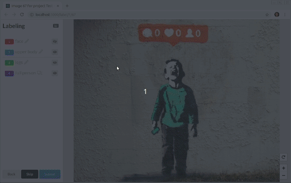
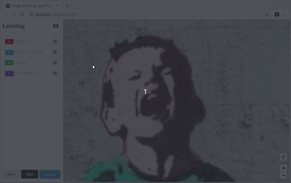
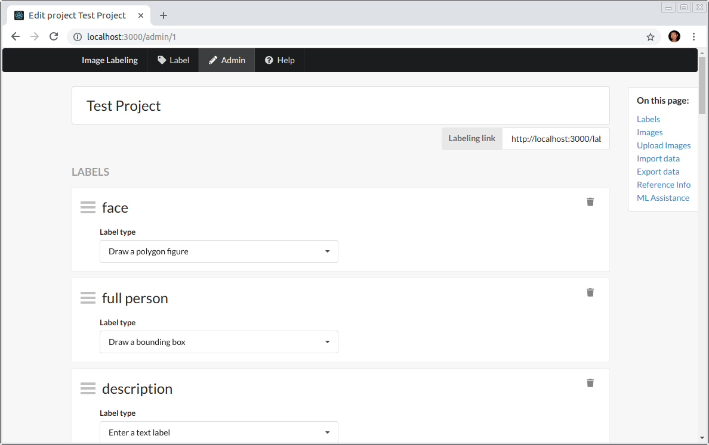

# Image Labeling Tool

This web app allows you to label images, draw bounding boxes, shapes, collect information in forms with dropdowns, checkboxes and inputs.

The labeling UI provides a lot of features for drawing polygon shapes, editing them with assisted tracing with auto-tracing based on edges or an external ML model.

## [Labeling Demo](http://slv.io/label-tool/demo/)

Demo of the labeling interface with all data served statically (no persistence, reverts on refresh).

## Screenshots

Bounding box labeling:



Segmentation with polygons:


Automatic tracing:



Assisted segmentation with Tensor Flow Serving:


Project configuration and custom labeling UI:



## Development

Install npm packages for client, server and the top-level folder:

```bash
yarn install
cd server && yarn install && cd ..
cd client && yarn install && cd ..
```

The server will run migrations on the first run if the database file doesn't exist already.

Run in the development mode:

```bash
env PORT=3000 API_PORT=3001 yarn start
```

## Build For Production

Build the client app:

```bash
cd client && yarn run build && cd ..
```

Now you can run the server app in prod mode serving the client build:

```bash
env PORT=80 NODE_ENV=production node server/src/index.js
```

## Config

The following environment variables can be tweaked:

- `PORT` - the part the app is served on (dev, prod)
- `API_PORT` - to differentiate the port for the API to run on (should be only used in dev)
- `UPLOADS_PATH` - absolute path where the app stores uploaded images, defaults to server's folder 'uploads'
- `DATABASE_FILE_PATH` - absolute path of the file where the app stores the SQLite data. Defaults to `database.sqlite` in the server folder

## Run in Docker

The default `Dockerfile` points to `/uploads` and `/db/db.sqlite` for persisted data, make sure to prepare those in advance to be mounted over. Here is an example mounting a local host directory:

```bash
mkdir ~/containersmnt/
mkdir ~/containersmnt/db/
mkdir ~/containersmnt/uploads/
```

Now build the container:

```bash
docker build -t imslavko/image-labeling-tool .
```

Run attaching the mounts:

```bash
docker run -p 5000:3000 -u $(id -u):$(id -g) -v ~/containersmnt/uploads:/uploads -v ~/containersmnt/db:/db -d imslavko/image-labeling-tool
```

Access the site at `localhost:5000`.

### Run with docker-compose

- Checkout the `docker-compose.yml` for detailed configuration.
- Need to set & export environment variable CURRENT_UID before running.

```bash
# if it needs to build the docker image,
CURRENT_UID=$(id -u):$(id -g) docker-compose up -d --build

# if it only needs to run,
CURRENT_UID=$(id -u):$(id -g) docker-compose up -d
```
## Project Support and Development

This project has been developed as part of my internship at the [NCSOFT](http://global.ncsoft.com/global/) Vision AI Lab in the beginning of 2019.
